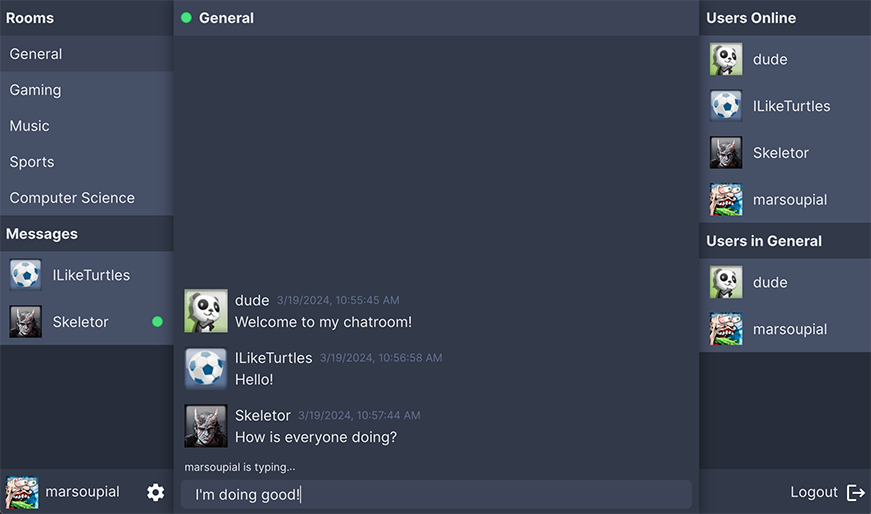

Site is currently deployed [here](https://messaging-app-uz05.onrender.com).
Monorepo located [here](https://github.com/Mark-Elliott5/messaging-app).

This messaging-app-frontend project features:

- Typescript
- A React SPA frontend for an online chatroom using websockets
- RESTful API consumption via Axios
- Tailwind
- Vite
- Framer Motion

This frontend is to be used with my messaging-app-backend repository. Navigate to the monorepo linked above for more information.

